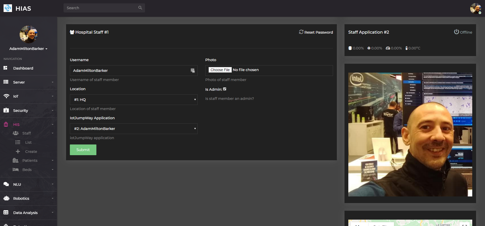

# Asociacion De Investigacion En Inteligencia Artificial Para La Leucemia Peter Moss
## HIAS Staff Android Application
[](https://github.com/LeukemiaAiResearch/HIAS-Staff-Android)

# Table Of Contents

- [Introduction](#introduction)
- [Required Hardware](#required-hardware)
- [Prerequisites](#prerequisites)
    - [Android Studio](#android-studio)
    - [HIAS Server](#hias-server)
    - [HIAS GeniSysAI Natural Language Understanding Engine](#hias-genisysai-natural-language=understanding-engine)
    - [HIAS GeniSysAI Facial Recognition Security System (Optional)](#hias-genisysai-facial-recognition-security-system-optional)
- [Installation](#installation)
  - [Clone The Repository](#clone-the-repository)
    - [Developer Forks](#developer-forks)
  - [iotJumpWay Application](#iotjumpway-application)
- [Contributing](#contributing)
    - [Contributors](#contributors)
- [Continue](#continue)
- [Versioning](#versioning)
- [License](#license)
- [Bugs/Issues](#bugs-issues)

# Introduction
The following guide will take you through setting up and installing the  [ Hospital Intelligent Automation System](https://github.com/LeukemiaAiResearch/HIAS-Staff-Android " Hospital Intelligent Automation System").

&nbsp;

# Required Hardware

- 1 x Android Phone or Tablet

&nbsp;

# Prerequisites
Before you can continue with this tutorial. Please ensure you have completed all of the following prerequisites.

## Android Studio
For this project, you need to have a running installation of [Android Studio](https://developer.android.com/studio).

## HIAS Server
For this project you need a full installation of the [HIAS](https://github.com/LeukemiaAiResearch/HIAS) server. Follow the [HIAS Installation Guide](https://github.com/LeukemiaAiResearch/HIAS/blob/master/Documentation/Installation/Installation.md) to complete your HIAS server setup.

## HIAS GeniSysAI Natural Language Understanding Engine
For this installation you need a running [HIAS GeniSysAI Natural Language Understanding Engine](https://github.com/LeukemiaAiResearch/GeniSysAI#natural-language-understanding-engines). Follow the [HIAS GeniSysAI Raspberry Pi 3 Natural Language Understanding Engine Installation Guide](https://github.com/LeukemiaAiResearch/GeniSysAI/tree/master/NLU/RPI/RPI3) to complete your NLU setup.

## HIAS GeniSysAI Facial Recognition Security System (Optional)
The [HIAS GeniSysAI Facial Recognition Security Systems](https://github.com/LeukemiaAiResearch/GeniSysAI/tree/master/Vision) can interact with your GeniSysAI Natural Language Understanding Engine by welcoming you when they see you, thus opening up a dialog. If you would like to integrate this feature chose one of the [HIAS GeniSysAI UP2 Facial Recognition Security Systems](https://github.com/LeukemiaAiResearch/GeniSysAI/tree/master/Vision).

&nbsp;

# Installation
The following guide will help you install the HIAS Staff Android Application.

## Clone the repository
Clone the [HIAS Staff Android Application](https://github.com/LeukemiaAiResearch/HIAS-Staff-Android "HIAS Staff Android Application") repository from the [Asociacion De Investigacion En Inteligencia Artificial Para La Leucemia Peter Moss](https://github.com/LeukemiaAiResearch "Asociacion De Investigacion En Inteligencia Artificial Para La Leucemia Peter Moss") Github Organization.

To clone the repository and install this project, make sure you have Git installed. Now navigate to the home directory on your device using terminal/commandline, and then use the following command.

```
  git clone https://github.com/LeukemiaAiResearch/HIAS-Staff-Android.git
```

Once you have used the command above you will see a directory called **HIAS** in your home directory.

```
  ls
```

Using the ls command in your home directory should show you the following.

```
  HIAS-Staff-Android
```

The HIAS-Staff-Android directory is your project root directory for this tutorial.

### Developer Forks
Developers from the Github community that would like to contribute to the development of this project should first create a fork, and clone that repository. For detailed information please view the [CONTRIBUTING](../CONTRIBUTING.md "CONTRIBUTING") guide. You should pull the latest code from the development branch.

```
  git clone -b "0.1.0" https://github.com/LeukemiaAiResearch/HIAS-Staff-Android.git
```

The **-b "0.1.0"** parameter ensures you get the code from the latest master branch. Before using the below command please check our latest master branch in the button at the top of the project README.

## iotJumpWay Application

For the Android application to work, you need your HIAS Server login credentials.

&nbsp;

# Continue
You can now continue with the [main tutorial](../) to use your application.

&nbsp;

# Contributing
Asociacion De Investigacion En Inteligencia Artificial Para La Leucemia Peter Moss encourages and welcomes code contributions, bug fixes and enhancements from the Github community.

Please read the [CONTRIBUTING](../CONTRIBUTING.md "CONTRIBUTING") document for a full guide to forking our repositories and submitting your pull requests. You will also find information about our code of conduct on this page.

## Contributors

- [Adam Milton-Barker](https://www.leukemiaresearchassociation.ai.com/team/adam-milton-barker "Adam Milton-Barker") - [Asociacion De Investigacion En Inteligencia Artificial Para La Leucemia Peter Moss](https://www.leukemiaresearchassociation.ai "Asociacion De Investigacion En Inteligencia Artificial Para La Leucemia Peter Moss") President/Founder & Intel Software Innovator, Sabadell, Spain

&nbsp;

# Versioning

You use SemVer for versioning. For the versions available, see [Releases](../releases "Releases").

&nbsp;

# License

This project is licensed under the **MIT License** - see the [LICENSE](../LICENSE "LICENSE") file for details.

&nbsp;

# Bugs/Issues

You use the [repo issues](../issues "repo issues") to track bugs and general requests related to using this project. See [CONTRIBUTING](../CONTRIBUTING.md "CONTRIBUTING") for more info on how to submit bugs, feature requests and proposals.